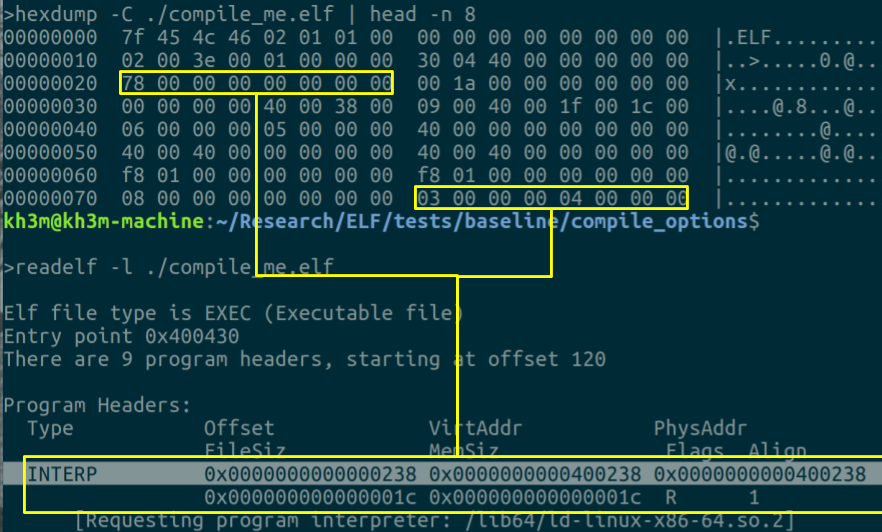

# **C -- ELF: nm/objdump**

## **Learnings**



- **What is the ELF format**

**ELF** for **E**xecutable and **L**inkable **F**ormat, is the common standard file format for **executable, object codes, shared libraries, and core dumps** (and even kernel boot image). ELF are the replacement to older file formats like **COFF** and **a.out** (Assembler Output).

<i>An ELF binary is made up of these components:</i>

- ELF HEADER: the "roadmap" for the loaders/linkers, contains general information about the binary (MSB or LSB ? 32 or 64-bits? ...) and includes locations to other parts of an the ELF.
- PROGRAM HEADER TABLE: a **PHT** describes the **segments** of an ELF binary. Useful to the loader and runtime linker (ld-Linux.so)
- SECTION HEADER TABLE: a **SHT** describes the **sections** of an ELF binary. Useful to the compile-time linker (ld), => its presence is optional for execution.
- SECTIONS & SEGMENTS: It's the actual "content" of the binary. **Sections are blocks of bytes present in linking view (on-disk) to produce segment, which provide a runtime/execution view**. <br>
  **Segments are blocks composed of one or more sections and produced by the linker.**

ELF is a very important topic for those who want to better understand reverse engineering, binary hacking, and program execution.
**Warning** ELF is not a **_quick-study topic_**, yet ELF is really an incredible composition of computer science at work, with program loading, dynamic linking, symbol table lookups, and many other tightly orchestrated components.

- **What are command `nm` and `objdump`**

1. The **nm command** <br>
   Right before we spoke about **_symbol table lookups_**...
   `man nm` show us
   Well, **Symbols** are a **symbolic reference** to some type of data or code such as a global variable or function.
   A programmer uses function names, variables names but the computer doesn't care about names, such as "printf()" or "malloc()", computers has a diet of **addresses**.
   Indeed, when programming we often use names, such as functions or variables used all throughout the program.
   These informations is what is known as the **program's symbolic information**.
   => Symbolic references in machine code gets translated into **offsets and addresses** in the compilation process.
   The functions and variables names are used as **symbolic names** to represent a particular location (in file or memory).
   These symbols are fixed-up with appropriate addresses, not labels/strings/names.

- **How to use them properly**

- **How to parse the content of an ELF file**

- **What information can be extracted from an ELF file**

- **What are the differences between `nm` and `objdump`**

**To access the symbol table and its associated symbols, you usually follow these steps:**

1. **Locate the section header table:** The section header table provides information about the sections in the ELF file, including the symbol table section. The section header table is typically located at a fixed offset within the ELF file, specified in the ELF header.

```
Elf64_Ehdr *ehdr = (Elf64_Ehdr *)map;
Elf64_Shdr *shdr = &map[ehdr->e_shoff];
bam ! =>> map pointer is moved to the section header table file offset
```

2. **Iterate through the section header entries:** Iterate through the section header entries in the section header table. Each entry describes a section in the ELF file. Here we look to determine and fix the pointer to the section header string table (`shstrtab`) , located at offset `sh_offset`, in the section header table entry at index `e_shstrndx`

   ```
   char *shstrtab = (char *) &map[sht[ehdr->e_shstrndx].sh_offset];
   // now we will iterate inside that string table to find SHT_SYMTAB or SH_DYNSYM
   ```

3. **Find the symbol table section:** Look for a section with the sh_type field set to SHT_SYMTAB or SHT_DYNSYM. These types indicate that the section contains symbol table entries.
   Retrieve the associated string table section: The symbol table entries usually reference symbol names stored in a string table section. The sh_link field of the symbol table section points to the index of the associated string table section.
   Access the symbol table entries: Once you have located the symbol table section and the associated string table section, you can access the symbol table entries using the appropriate structure (Elf32_Sym or Elf64_Sym). The symbol table entries are contiguous within the symbol table section.
   By following these steps and accessing the symbol table via the sections, you can iterate through the symbol table entries, extract information about each symbol, and work with the symbols in the ELF file.

## **nm command**

Basic usage is `nm <path_to_binary>` which will basically display 3 columns as follow:

```
0000000000003d88 d _DYNAMIC
0000000000003f78 d _GLOBAL_OFFSET_TABLE_
0000000000002000 R _IO_stdin_used
                 w _ITM_deregisterTMCloneTable
                 w _ITM_registerTMCloneTable
0000000000002180 r __FRAME_END__
000000000000207c r __GNU_EH_FRAME_HDR
0000000000004010 D __TMC_END__
000000000000038c r __abi_tag
0000000000004010 B __bss_start
                 w __cxa_finalize@GLIBC_2.2.5
0000000000004000 D __data_start
0000000000001200 t __do_global_dtors_aux
0000000000003d80 d __do_global_dtors_aux_fini_array_entry
0000000000004008 D __dso_handle
0000000000003d78 d __frame_dummy_init_array_entry
                 w __gmon_start__
                 U __libc_start_main@GLIBC_2.34
                 U __stack_chk_fail@GLIBC_2.4
0000000000004010 D _edata
0000000000004030 B _end
0000000000001654 T _fini
0000000000001000 T _init
0000000000001160 T _start
0000000000004028 b completed.0
0000000000004000 W data_start
0000000000001190 t deregister_tm_clones
                 U exit@GLIBC_2.2.5
                 U fprintf@GLIBC_2.2.5
0000000000001240 t frame_dummy
                 U fstat@GLIBC_2.33
000000000000150a T main
                 U mmap@GLIBC_2.2.5
                 U open@GLIBC_2.2.5
                 U perror@GLIBC_2.2.5
0000000000001249 T print_symbols
                 U puts@GLIBC_2.2.5
00000000000011c0 t register_tm_clones
0000000000004020 B stderr@GLIBC_2.2.5
                 U strncmp@GLIBC_2.2.5
```

The 'nm' tool list the symbols from binary file:

1. Column 1 -- **Symbol Address/Value** this column shows the memory address or value associated with the symbol. For functions or variables, it represents the address where the symbol is located in memory.

2. Column 2 -- **Symbol Type** Indicates the type or category of symbol. Wether the symbol is function, object (variable), special symbol, such as a section or even undefined reference.

3. Column 3 -- **Symbol Name** displays the name of the symbol. Represents the identifier or label associated with a particular function, vatriable, or other symbol within the exec / obj file.

==> This three-column format provides a concise summary of the symbols present oin the binary, giving information about their addresses, types, and names. It helps in understanding symbol layout, resolving sylmbol dependencies, and analyzing the binary's symbol table.

**Symbol Address/Value** & **Symbol Type** are retrieved from the **symtab** and/or **dynsym** symbol tables, according to the symbols present in the binary.

**Symbol Name** are picked from the **strtab** and/or the **dynstr** table, according to the syumbol present in the binary file.

### **Sources**

The excellent "BINARY*DISSECTION_COURSE" by \*\*\_Abhinav Thakur*\*\*
=> https://github.com/compilepeace/BINARY_DISSECTION_COURSE/tree/master

Series of articles on ELF on intezer.com
=> https://intezer.com/blog/research/executable-linkable-format-101-part1-sections-segments/
